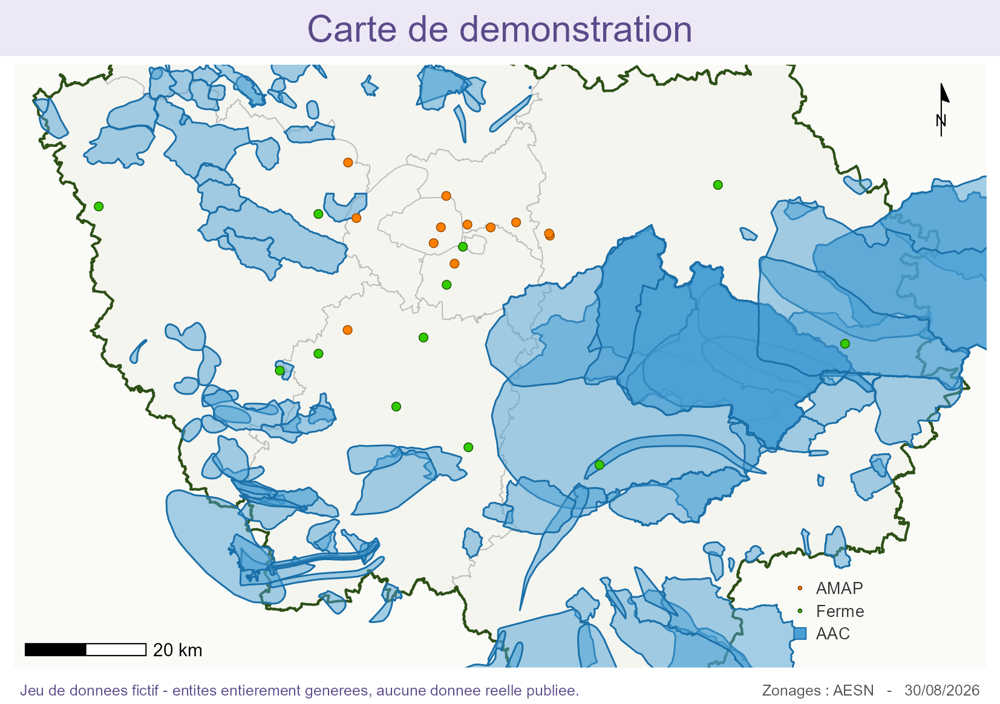

# Portfolio — Paul Crozatier

Site personnel et démonstration d'une application cartographique R/Shiny.

- **Portfolio** → [paulcrozatier.github.io](https://paulcrozatier.github.io)
- **Démonstration jouable** → [paulcrozatier.github.io/demo/](https://paulcrozatier.github.io/demo/)
- **Code de l'application** → dossier [`app/`](app/)

L'application tourne **entièrement dans le navigateur**, compilée en WebAssembly via
[shinylive](https://posit-dev.github.io/r-shinylive/). Aucun serveur R n'est nécessaire.
Le premier chargement télécharge le moteur R et ses paquets (~150 Mo) et prend de trente
secondes à deux minutes selon la connexion ; les suivants sont mis en cache par le navigateur.

---

## L'application

> **Jeu de données fictif.** Les AMAP et fermes affichées sont entièrement générées et n'existent pas.
> Aucune donnée réelle du réseau n'est publiée. L'interface, les filtres, la typologie de zonage,
> les calculs d'itinéraire et les exports sont ceux de l'outil d'origine.

Application R/Shiny cartographique développée pendant un stage de fin d'études pour un réseau
associatif agricole francilien. Elle met en relation des groupes de consommateurs et des fermes
partenaires : exploration filtrée du réseau, recherche de partenariats potentiels, typologie sur
zonages environnementaux, mutualisation de tournées, calculs d'itinéraire et exports.

Ce dépôt est une **démonstration publique**. La version de production lit une base MariaDB
interne ; celle-ci lit un fichier JSON généré. Le code de la carte, des filtres et des traitements
est le même.



*Image produite par la fonction d'export du logiciel lui-même : bandeau, échelle, flèche nord,
légende et zonages AAC sont générés par `R/04_export_image.R`.*

---

## Pourquoi des données générées plutôt que nettoyées

Le nettoyage par motifs de la base réelle a été tenté et a échoué. Deux raisons structurelles :

- **les coordonnées de contact étaient dispersées dans trois structures différentes** — la table des
  groupes, celle des fermes, et celle des créneaux de distribution, qui portait à elle seule
  `contact_nom`, `contact_prenom`, `contact_tel`, `contact_portable`, `contact_mail` et
  `contact_mail2` ;
- **une note interne rédigée en prose sur un adhérent n'était détectable par aucune expression
  régulière.** Un champ de commentaire libre ne se filtre pas de façon fiable.

La base contient par ailleurs des empreintes de mot de passe, des jetons, des adresses, des codes
INSEE et des données économiques d'exploitation. Elle n'est pas expurgeable.

D'où le choix retenu : **ne rien expurger, tout générer.** Le générateur ne peut structurellement
pas produire de donnée personnelle, parce qu'il n'a aucune donnée réelle en entrée et que toutes
ses valeurs, hors les noms, appartiennent à des nomenclatures fermées.

## Ce qui est publié, ce qui ne l'est pas

### Champs générés et publiés

| Entité | Champs |
|---|---|
| AMAP | `id_groupe`, `nom_amap`, `statut_amap`, `jour`, `h_debut`, `h_fin`, `nb_adh`, `lat`, `lon` |
| Ferme | `id_ferme`, `nom_ferme`, `statut_ferme`, `certif`, `annee_amap`, `id_productions`, `id_productions_amap`, `id_productions_sec`, `lat`, `lon` |
| Partenariat | `id_part`, `id_ferme`, `id_groupe`, `id_produits`, `date_fin` |

### Champs exclus de la donnée **et** du code

`cp_amap`, `ville_amap`, `cp_ferme`, `ville_ferme`, `nom_lieu`, `id_lieu`, `mail_amap`, `tel_amap`,
`portable_amap`, `tel_ferme`, `mail_ferme`, `siteweb`, et le champ de texte libre `produits`.

Ces champs ne sont pas seulement absents du fichier de données : **aucune ligne de code ne les
nomme**. Un champ retiré de la donnée mais toujours référencé dans l'application resterait une
fuite en puissance — il suffirait de rebrancher la base pour qu'il réapparaisse. Le script de
contrôle balaie `app.R` pour le vérifier.

L'exclusion du **code postal et de la commune** mérite une explication, parce qu'elle n'est pas
intuitive. Une exploitation géolocalisée, avec sa commune et sa production, est réidentifiable par
quiconque connaît le territoire, même privée de son nom : retirer le nom produit de la
pseudonymisation, pas de l'anonymisation, et une donnée pseudonymisée reste une donnée
personnelle. S'y ajoute que beaucoup de ces exploitations sont individuelles — la raison sociale
est le nom de la personne et l'adresse d'exploitation est souvent son domicile. Le point étant déjà
sur la carte, commune et code postal n'apportent rien à la démonstration et recréent le risque.

## Différences avec la version de production

| | Production | Démonstration |
|---|---|---|
| Source de données | MariaDB, 4 vues SQL versionnées | `data/donnees_demo.json`, généré |
| Volumes | 405 AMAP, 608 fermes, 1 692 partenariats actifs | 405 AMAP, 400 fermes, 1 903 partenariats actifs |
| Emprise des fermes | 392 en Île-de-France, 216 hors région | toutes en Île-de-France |
| Recherche plein texte | nom, commune, code postal, lieu | nom uniquement |
| Panneau de détail | + adresse, téléphone, courriel | statut, productions, partenaires |
| Exports tableur | + colonnes CP, Ville, Tél, Email | sans ces colonnes, + feuille « Avertissement » |
| Localisation d'ancrage | code postal + commune | coordonnées arrondies |
| Fond de carte par défaut | CartoDB Positron | OpenStreetMap (Positron exige désormais une clé d'API) |
| Identité visuelle | logo et police de marque du réseau | palette neutre, polices système |
| Connexion base | `DBI` + `RMariaDB`, `.Renviron` | aucune — ni chaîne de connexion, ni secret |

## Fonctionnalités

**Mode Exploration** — recherche par nom ; filtres par département et commune (sélection multiple,
les 20 arrondissements remplaçant Paris), jour de distribution, statut d'AMAP, statut de ferme,
production présente, production absente ; rayon défini par clic sur la carte ; couches AMAP, fermes,
AAC et ZPA ; bandeau de filtres actifs avec réinitialisation unitaire ; encadré d'indicateurs
calculable sur le réseau entier ou sur l'emprise visible ; sélection manuelle d'entités.

**Mode Mise en relation** — ancrage sur une AMAP, une ferme ou un point libre ; recherche par
production, jour et rayon ; tracé des liens ferme–AMAP colorés par jour de livraison ; rayon de
mutualisation de tournée ; jusqu'à 8 recherches sauvegardées, renommables ; légende dynamique.

**Typologie AESN** — classification binaire des fermes et des AMAP selon leur appartenance aux
aires d'alimentation de captage (AAC) et zones de protection (ZPA), l'AMAP étant classée par lien
de partenariat et non par sa propre position.

**Itinéraire** — direct, tournée optimisée (jusqu'à 50 étapes) ou étapes choisies au clic, via le
service public OSRM ; ouverture dans Google Maps ; export GPX compatible OsmAnd et Garmin.

**Exports** — tableur multi-feuilles (openxlsx) et image PNG en A5, A4 ou A3 avec échelle, flèche
nord et légende. La mention « jeu de données fictif » voyage avec chaque fichier téléchargé.

## Lancer l'application en local

```bash
Rscript -e "shiny::runApp('app', port = 4321, launch.browser = TRUE)"
```

Dépendances : `shiny`, `sf`, `dplyr`, `tidyr`, `leaflet`, `openxlsx`, `here`, `httr`, `jsonlite`,
`ggplot2`, `ggspatial`, `cowplot`. L'environnement exact est figé dans `app/renv.lock`.

## Régénérer l'export WebAssembly

```bash
Rscript -e "shinylive::export('app', 'demo')"
Rscript tools/injecter_loader.R
```

**La seconde commande n'est pas optionnelle.** `shinylive::export()` regénère
entièrement `demo/index.html` et efface donc l'écran d'attente. Sans lui, la
démonstration repart sur un écran blanc d'environ une minute, sans aucune
explication — ce qu'un visiteur lit comme un lien mort. Le script est
idempotent : le relancer sans avoir réexporté ne fait rien.

Cet écran d'attente explique ce qui se passe pendant le chargement, affiche un
compteur de secondes et un aperçu de l'application. Il disparaît dès que la
carte est peinte. La détection se fait depuis le document parent en sondant le
`contentDocument` de l'iframe et la disparition du `.loading-wrapper` interne
de shinylive : l'événement `shiny:connected` ne convient pas, l'application
s'exécutant dans une iframe que le document parent ne reçoit pas.

Le dossier `demo/` est versionné : le site est ainsi servi tel quel par GitHub Pages, sans
étape de construction. Il pèse environ 150 Mo, dont 70 paquets R compilés en WebAssembly.

## Régénérer les données

```bash
cd app && Rscript R/generer_donnees_demo.R
```

Le générateur part d'une **graine fixe** : deux exécutions produisent un fichier identique à
l'octet près. Aucun horodatage n'entre dans la sortie, ce qui préserve cette propriété.

Les volumes et les distributions sont calqués sur des agrégats relevés sur la base réelle —
répartition des statuts, des jours, des horaires, des certifications, des productions, nombre
d'adhérents, nombre de partenaires par AMAP — de sorte que la carte ait la densité d'un vrai
réseau. Les AMAP sont concentrées sur le cœur dense (distance médiane au centre : 15 km), les
fermes en couronne périphérique (médiane 42 km), et les partenariats tirés avec décroissance
exponentielle de la distance.

Les noms sont composés par assemblage de deux listes fermées : une tête et un qualifiant tiré d'un
lexique de matières, minéraux et couleurs. Ce lexique a été filtré deux fois — aucun prénom
français (Garance, Ambre, Jade, Opale, Corail, Amarante, Lilas, Émeraude, Iris, Azur ont été
écartés), aucun toponyme. **Le générateur ne peut pas produire un nom de personne ni un nom de
lieu.**

## Contrôle de conformité

```bash
cd app && Rscript R/verifier_donnees_demo.R --noms-reels=../../noms_reels.txt
```

Neuf contrôles bloquants, dont le résultat complet est versionné dans
`app/verification_sortie.txt` :

| | Contrôle |
|---|---|
| C1 | Aucun champ hors liste blanche |
| C2 | Aucun nom de champ banni dans le JSON, à quelque profondeur que ce soit |
| C3 | Aucun motif de donnée personnelle dans les valeurs — courriel, téléphone, code postal, URL, numéro de voie |
| C4 | Aucun texte libre : hors les noms, toute valeur appartient à une nomenclature déclarée |
| C5 | Noms uniques, assemblés, sans civilité ni forme juridique |
| C6 | Toutes les coordonnées dans l'emprise francilienne |
| C7 | Le code de l'application ne référence aucun champ banni |
| C8 | Aucun secret ni connexion base dans le code publié |
| C9 | Aucun nom généré ne coïncide avec un nom réel |

Le contrôle C9 nécessite un fichier local de noms réels, produit hors du dépôt puis supprimé.
Sans lui, il sort en **NON EXEC** — ce qui n'est pas une réussite : le script rend alors un code
de sortie non nul et refuse de conclure à la publiabilité.

## Données géographiques

Les couches `data/*.rds` sont des données publiques : contours régional, départementaux et
communaux, arrondissements de Paris, et zonages environnementaux **AAC et ZPA de l'Agence de
l'eau Seine-Normandie (AESN)**. Elles ne contiennent aucune donnée personnelle.

## Structure

```
index.html                         page portfolio
tools/loader.html                  ecran d'attente de la demo
tools/injecter_loader.R            le reinjecte apres chaque export
assets/apercu-carte.png            export cartographique produit par l'application
demo/                              application compilée en WebAssembly (servie par Pages)
app/
├── app.R                          application Shiny
├── .here                          ancre les chemins de `here` sur ce dossier
├── R/02_helpers.R                 formatage des horaires
├── R/03_productions.R             référentiel fermé des 23 productions
├── R/04_export_image.R            export cartographique PNG
├── R/generer_donnees_demo.R       générateur, graine fixe
├── R/verifier_donnees_demo.R      contrôle de conformité, bloquant
├── R/_disable_autoload.R          empêche Shiny de sourcer les utilitaires ci-dessus
├── data/donnees_demo.json         jeu fictif
├── data/*.rds                     couches géographiques publiques
├── tests/testthat/                tests unitaires
├── renv.lock                      environnement figé
└── verification_sortie.txt        sortie du contrôle de conformité
```

## Note technique — portage WebAssembly

Deux ajustements ont été nécessaires pour que l'application tourne dans le navigateur :

- **Attente d'initialisation de la carte.** Sous webR, l'observateur qui dessine les couches
  se déclenchait avant que le widget leaflet existe : les mises à jour partaient dans le vide
  et aucun marqueur ne s'affichait. Une garde `req(input$carte_bounds)` attend le premier
  signal émis par la carte.
- **Allègement de la couche des communes.** Elle pesait 8,3 Mo sur 11,2 Mo de données.
  Simplification géométrique à 25 m et suppression de dix attributs inutilisés : **0,55 Mo**,
  soit quinze fois moins, à nombre de communes et de départements identiques.

Le calcul d'itinéraire fonctionne depuis le navigateur : le service OSRM renvoie
`Access-Control-Allow-Origin: *`.
